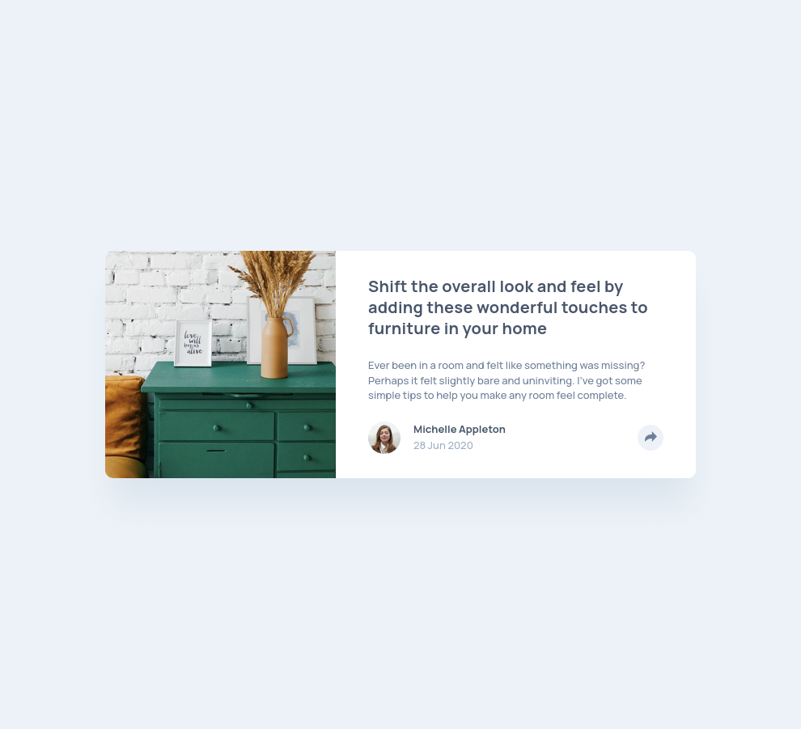
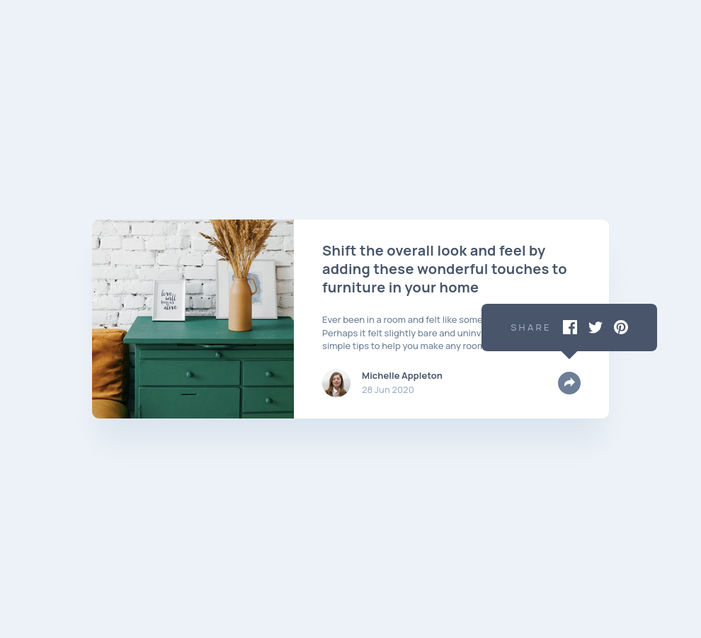

# Frontend Mentor - Article preview component solution

This is a solution to the [Article preview component challenge on Frontend Mentor](https://www.frontendmentor.io/challenges/article-preview-component-dYBN_pYFT). Frontend Mentor challenges help you improve your coding skills by building realistic projects. 

## Table of contents

- [Overview](#overview)
  - [The challenge](#the-challenge)
  - [Screenshot](#screenshot)
  - [Links](#links)
- [My process](#my-process)
  - [Built with](#built-with)
  - [What I learned](#what-i-learned)
  - [Continued development](#continued-development)
- [Author](#author)

**Note: Delete this note and update the table of contents based on what sections you keep.**

## Overview

### The challenge

Users should be able to:

- View the optimal layout for the component depending on their device's screen size
- See the social media share links when they click the share icon

### Screenshot

### Links

- Solution URL: [Frontent Mentor Solution](https://www.frontendmentor.io/solutions/article-preview-component-modern-css-fluid-responsive-design-NDTQ880c-9)
- Live Site URL: [Github Pages](https://sprees.github.io/fe-mentor_article-preview-component/)

## My process

### Built with

- Semantic HTML5 markup
- CSS custom properties
- Flexbox
- CSS Grid
- Mobile-first workflow

### What I learned

During this project I learned how to use `object-fit` and `object-position`, although I would love to know how others went about this, as I don't like my final result. I also learned it can be difficult to style an SVG that is being used in an ``. I ended up using `filter: brightness(100);` to change the socials icon button color when active. If there is a better way, I'd love to hear it!

### Continued development

I will continue to explore how to use images in a responsive way, along with fluid responsive design concepts.

## Author

- Website - [Sprees | Github](https://github.com/sprees)
- Frontend Mentor - [@Sprees](https://www.frontendmentor.io/profile/sprees)
